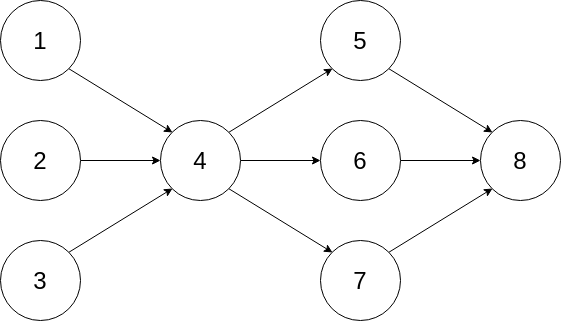

<p align="center">
  
</p>

# DaggerAI

A simple and powerful Typescript based agent framework to help businesses thrive in the AI Agent revolution.

👨‍💼 + 🧠🤖 = 💰

## About

DaggerAI is a project that helps developers deploy AI agents.

Our mission is to make AI wide available and empower all developers to quickly deploy applications that will help them improve their lives and the lives of others.

DaggerAI was design to be simple and easy to reason about. The Agents will execute Tasks to automate and solve real world business problems with the power of large language models from OpenAI, Anthropic or Meta. The agents can also use tools (Calculator, Internet Search, Google Mail, etc) to complete their tasks.

## Architecture

We use **DAGs** (Directed Acyclic Graphs) to define the workflow of the agents. This allows us to define the order of execution of the tasks and the dependencies between them.

Tasks can use the output of previous tasks, all you have to do is to **connect the tasks** that **depend** on each other.

We find this approach to be very powerful and easy to reason about. It is possible to create new tasks on the fly and add them dinamically to the workflow. The possibilities are endless.

<p>
  
</p>

## Why DaggerAI

Currently all agent based frameworks are written for cutting-edge developers, with a lot of complex code and logic, many abstraction layers and complex dependencies (ex: langchain).

This approach is not ideal for newcomers to the AI space.

We also decided to build it with Typescript, we feel the JS community needs more ❤️ when it comes to AI.

## Key Features

- **Create AI Agents**: Create AI agents that have access to tools like Calculator, Web Search, Email or any other tool you can think of.
- **Create Agent Tasks**: Agents execute tasks that are organized in a [DAG - Directed Acyclic Graph](https://en.wikipedia.org/wiki/Directed_acyclic_graph) that defines the order of execution of those tasks.
- **Choose paid or open source**: You can use paid LLMs like gpt-4/claude-3 or open source models like lamma3 or mistral.

## How DaggerAI compares

- **Autogen**: a great tool that enable agents to work together but lacks a process to follow and the results are not reliable without a lot of work. Programming and setting up agents is complex and time consuming, specially when the task grows.
- **ChatDev**: It introduces the idea of a process, mostly for building apps and it is not focused on business use cases that require a clear goal and a clear process to follow.
- **CrewAI**: A great tool that inspired us (kudos to João for his great work). It is focused on the more advanced user with a good knowledge of python and programming for customization. It is heavily dependant on langchain which makes it a bit harder to customize.

## Getting Started

Make sure you have the lattest version of [Node.js](https://nodejs.org/en/download) installed.

### 1. Installation

Add DaggerAI to your project by running the following command in your terminal:

```
npm install daggerai
```

### 3. Create and run a Squad

```typescript
import {
  Squad,
  Agent,
  SerperTool,
  Task,
  ChatOpenAI,
  ChatAnthropic,
} from 'daggerai'

const squad = new Squad()

// You can use multiple LLMs (one for each task) if you want
process.env['ANTHROPIC_API_KEY'] = 'your-anthropic-api-key'
const llm = new ChatAnthropic({
  model: 'claude-3-haiku-20240307',
  maxTokens: 4000,
})

// You can also use OpenAI models
// process.env['OPENAI_API_KEY'] = 'your-openai-api-key'
// const llm = new ChatOpenAI({
//   model: 'claude-3-haiku-20240307',
//   maxTokens: 4000,
// })

// Create the websearch tool
process.env['SERP_API_KEY'] = 'your-serp-api-key'
const serperTool = new SerperTool()

const blogWriter = new Agent({
  role: 'Social Media Blog Writer',
  backstory:
    'As a Social Media Blog Writer, I create engaging and shareable content tailored to a target audience. From topic ideation to keyword research and captivating introductions, I deliver high-quality blog posts that drive traffic and engagement.',
  goal: 'Create amazing social media blog posts.',
})

const research = new Task({
  name: 'Research',
  description: 'Research the topic for the blog post.',
  expectedOutput: 'A list of key points and sources for the blog post.',
  agent: blogWriter,
  tools: [serperTool],
  llm,
})

const outline = new Task({
  name: 'Blog Post Outline',
  description: 'Create an outline for the blog post.',
  expectedOutput: 'A structured outline for the blog post.',
  agent: blogWriter,
  llm,
})

const blogPost = new Task({
  name: 'Blog Post',
  description: 'Write the blog post.',
  expectedOutput: 'A well-written and engaging blog post.',
  agent: blogWriter,
  llm,
})

// add the tasks to the squad
squad.add(research)
squad.add(outline)
squad.add(blogPost)

/**
 * Connect the tasks to define the order of execution and dependencies.
 * In this example outline will receive the output of research task
 * and blogPost will receive the output of outline task.
 */
squad.connect(research, outline)
squad.connect(outline, blogPost)

const results = await squad.evaluate()
console.log(results)
```

## Roadmap

- [ ] Add more tools
- [ ] Create interface for building squads
- [ ] Add streaming responses
- [ ] Integrate with frontend for chat like interface
- [ ] Create interface for requesting inputs from the user

## Contribution

DaggerAI is open-source and we welcome contributions. If you're looking to contribute, please:

Fork the repository.
Create a new branch for your feature.
Add your feature or improvement.
Send a pull request.

We appreciate your input!

## License

DaggerAI is released under the MIT License.

## Hire Us

We love helping companies deploy AI agents to solve real business problems. If you are interested feel free to email me at rodamora@gmail.com
